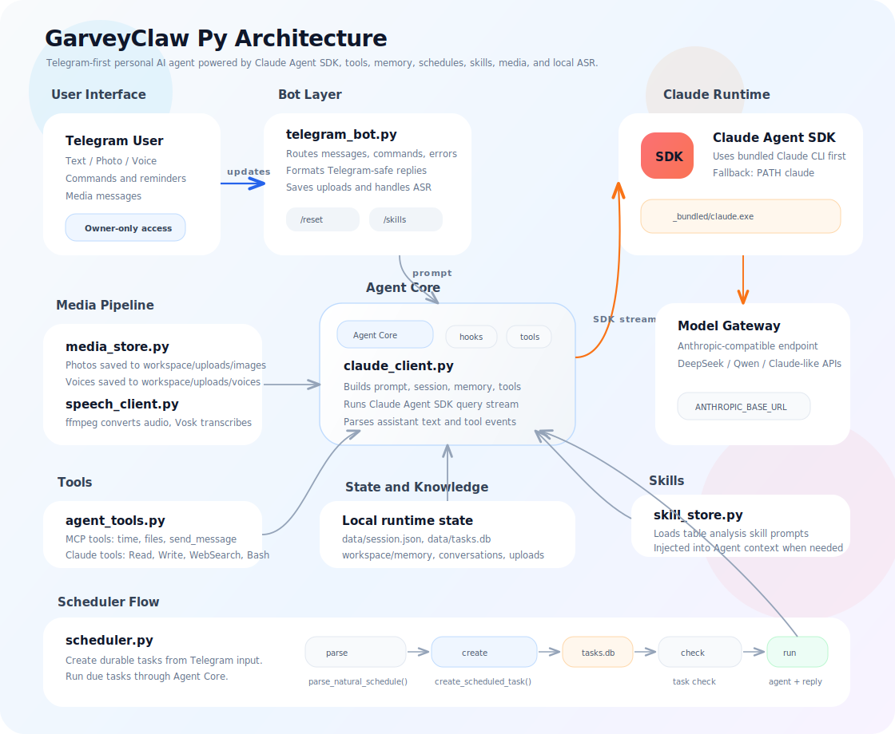

# GarveyClaw Py

GarveyClaw Py 是一个基于 Claude Agent SDK 和 Telegram Bot 的个人智能体项目。它把 Telegram 作为交互入口，把 Claude Code / Claude Agent SDK 作为智能体运行核心，并逐步接入工具、记忆、定时任务、图片理解、语音转文字和 Skill 能力。

这个项目适合两类用途：

- 作为个人长期运行的 Telegram AI Agent。
- 作为学习 Claude Agent SDK、MCP 工具、自定义 Agent 能力的工程样板。

## 功能特性

- Telegram 文本、图片、语音消息处理。
- Claude Agent SDK 模型调用。
- Claude Code 内置工具显性化，例如 `Read`、`Write`、`Edit`、`Glob`、`Grep`、`WebSearch`、`WebFetch`、`Bash`。
- 自定义 MCP 工具，例如获取时间、读取工作区文件、发送 Telegram 消息。
- Owner 权限控制，只处理指定 Telegram 用户的消息。
- 连续会话，通过本地 `session_id` 维持上下文。
- 长期记忆，使用 `CLAUDE.md` 和按天归档的对话记录。
- 定时任务，支持一次性、每天、每周任务。
- 自然语言创建定时提醒，例如“30秒后提醒我喝水”。
- Skill 能力，目前包含表格数据分析与校验 Skill。
- 可选本地 ASR，使用 `ffmpeg` + Vosk 处理 Telegram 语音消息。

## 项目架构



整体流程可以理解为：

- Telegram 负责接收 owner 的文本、图片、语音和命令。
- `telegram_bot.py` 负责消息路由、权限判断、媒体保存、格式化回复和异常处理。
- `claude_client.py` 是 Agent 编排核心，负责组装 prompt、session、memory、skills、tools，并通过 Claude Agent SDK 调用模型。
- Claude Agent SDK 会优先启动 SDK 包内自带的 bundled Claude CLI，再连接兼容 Anthropic API 的模型服务。
- 自定义 MCP tools、Claude Code 内置工具、长期记忆、定时任务、Skill、ASR 都作为独立模块接入 Agent Core。
- `data/`、`workspace/memory/`、`workspace/uploads/` 都是本地运行态数据，默认不提交到 GitHub。

## 环境要求

建议使用独立 Conda 环境运行，不要混用系统 Python 或其他项目环境。

基础要求：

- Python `>=3.12`
- Conda 或 Miniconda
- Git
- 一个 Telegram Bot Token
- 一个兼容 Anthropic API 协议的模型服务

可选语音识别要求：

- `ffmpeg`
- Vosk Python 包
- Vosk 中文模型

## 安装

1. 克隆项目

```powershell
git clone git@github.com:lianjiawei/garveyclaw-py.git
cd garveyclaw-py
```

2. 创建并激活 Conda 环境

```powershell
conda create -n garveyclaw python=3.12 -y
conda activate garveyclaw
```

3. 安装项目依赖

```powershell
python -m pip install -e .
```

如果需要语音转文字能力，安装 ASR 可选依赖：

```powershell
python -m pip install -e ".[asr]"
```

4. 确认 Claude Code CLI 可用

本项目通过 Claude Agent SDK 调用 Claude Code 能力。SDK 底层会启动 Claude Code CLI 子进程，通常会优先使用 SDK 包中自带的 bundled CLI，不需要额外手动安装 Claude Code CLI。

如果运行时报 `Claude Code not found`，再安装 Claude Code CLI，或确保系统 PATH 中可以找到 `claude` 命令。也可以用下面的命令检查当前系统是否已经有全局 `claude`：

```powershell
claude --version
```

注意：即使上面的命令不存在，只要 SDK 自带的 bundled CLI 可用，项目仍然可以正常运行。

## 配置

项目通过 `.env` 读取运行配置。仓库只提供 `.env.example`，真实 `.env` 不应该提交到 GitHub。

复制配置模板：

```powershell
Copy-Item .env.example .env
```

然后把 `.env` 里的占位值替换成你自己的配置。

最小必填配置：

```env
TELEGRAM_BOT_TOKEN=your_telegram_bot_token
OWNER_ID=your_telegram_user_id
ANTHROPIC_API_KEY=your_api_key
ANTHROPIC_BASE_URL=https://your-compatible-endpoint
ANTHROPIC_MODEL=your_model_name
```

常用配置说明：

- `TELEGRAM_BOT_TOKEN`：Telegram Bot Token，可以从 BotFather 获取。
- `OWNER_ID`：允许使用机器人的 Telegram 用户 ID，非 owner 用户会被忽略。
- `ANTHROPIC_API_KEY`：模型服务 API Key。
- `ANTHROPIC_BASE_URL`：兼容 Anthropic API 的服务地址。
- `ANTHROPIC_MODEL`：默认主模型名称。
- `WORKSPACE_DIR`：Agent 可以操作的工作区目录，默认是项目下的 `workspace/`。
- `SHOW_TOOL_TRACE`：是否把工具调用过程发送到 Telegram，`1` 开启，`0` 关闭。
- `SCHEDULER_INTERVAL_SECONDS`：定时任务轮询间隔，默认 `30` 秒。

DeepSeek 模型分组示例：

```env
ANTHROPIC_DEFAULT_OPUS_MODEL=deepseek-v4-pro
ANTHROPIC_DEFAULT_SONNET_MODEL=deepseek-v4-pro
ANTHROPIC_DEFAULT_HAIKU_MODEL=deepseek-v4-flash
CLAUDE_CODE_SUBAGENT_MODEL=deepseek-v4-pro
```

Claude Code 行为控制示例：

```env
CLAUDE_CODE_DISABLE_NONESSENTIAL_TRAFFIC=1
CLAUDE_CODE_DISABLE_NONSTREAMING_FALLBACK=1
CLAUDE_CODE_EFFORT_LEVEL=max
```

## 语音识别配置

语音识别是可选功能。不开启时，机器人仍然可以正常处理文本和图片。

1. 安装 `ffmpeg`

Windows 可以使用 winget：

```powershell
winget install Gyan.FFmpeg
```

安装后确认：

```powershell
ffmpeg -version
```

2. 安装 ASR 可选依赖

```powershell
python -m pip install -e ".[asr]"
```

3. 下载 Vosk 中文模型

模型下载地址：

[Vosk Models](https://alphacephei.com/vosk/models)

轻量中文模型推荐：

- `vosk-model-small-cn-0.22`

解压后在 `.env` 中配置：

```env
ASR_PROVIDER=vosk
VOSK_MODEL_DIR=E:\AICode\Models\vosk-model-small-cn-0.22
```

如果暂时不使用语音识别：

```env
ASR_PROVIDER=none
```

## 启动

推荐启动方式：

```powershell
python -m garveyclaw
```

如果已经执行过 `python -m pip install -e .`，也可以使用脚本入口：

```powershell
garveyclaw
```

启动成功后，终端会显示：

```text
Bot is running...
```

本地开发时，按 `Ctrl + C` 可以停止机器人。

## Telegram 使用

基础命令：

- `/start`：查看机器人简介。
- `/reset`：清空当前连续会话。
- `/memory`：查看长期记忆。
- `/remember 内容`：追加一条长期记忆。
- `/skills`：查看可用 Skills。
- `/tasks`：查看待执行定时任务。
- `/cancel 任务ID`：取消定时任务。
- `/schedule_in 秒数 内容`：创建一个命令式延迟任务。

自然语言示例：

```text
30秒后提醒我喝水
明天早上9点提醒我整理日报
每天下午3点提醒我站起来活动一下
每周一早上9点提醒我开例会
```

图片和语音：

- 发送图片时，机器人会保存图片并把图片路径交给 Agent 处理。
- 发送语音时，如果开启 ASR，机器人会先转写语音，再把转写文本交给 Agent 处理。

## 项目结构

```text
garveyclaw_py/
├─ pyproject.toml
├─ .env.example
├─ README.md
├─ COURSE_GUIDE.md
├─ claw_course_bot.py
├─ skills/
│  └─ table_analysis_skill.md
├─ src/
│  └─ garveyclaw/
│     ├─ __main__.py
│     ├─ access.py
│     ├─ agent_tools.py
│     ├─ app.py
│     ├─ claude_client.py
│     ├─ config.py
│     ├─ media_store.py
│     ├─ memory_store.py
│     ├─ scheduler.py
│     ├─ scheduler_store.py
│     ├─ session_store.py
│     ├─ skill_store.py
│     ├─ speech_client.py
│     ├─ telegram_bot.py
│     └─ telegram_formatting.py
├─ data/
└─ workspace/
```

核心模块说明：

- `app.py`：程序入口，初始化日志并启动 Telegram 轮询。
- `config.py`：读取 `.env` 并提供全局配置。
- `access.py`：Owner 权限判断。
- `telegram_bot.py`：Telegram 命令、文本、图片、语音和异常处理。
- `claude_client.py`：封装 Claude Agent SDK 调用、工具配置、会话和记忆注入。
- `agent_tools.py`：自定义 MCP 工具。
- `media_store.py`：保存 Telegram 图片和语音文件。
- `speech_client.py`：语音识别抽象层，目前支持 Vosk。
- `memory_store.py`：长期记忆和对话记录。
- `session_store.py`：连续会话 `session_id` 读写。
- `scheduler.py`：定时任务解析、创建、执行和管理。
- `scheduler_store.py`：定时任务 SQLite 表初始化和读写。
- `skill_store.py`：Skill 加载和查询。
- `telegram_formatting.py`：把常见 Markdown 转成 Telegram 可渲染 HTML。

## 运行数据

运行过程中会自动生成一些本地数据，这些文件默认不会提交到 GitHub。

```text
data/
├─ garveyclaw_session.json
└─ garveyclaw_tasks.db

workspace/
├─ memory/
│  ├─ CLAUDE.md
│  └─ conversations/
└─ uploads/
   ├─ images/
   └─ voices/
```

说明：

- `data/garveyclaw_session.json`：保存连续会话 ID。
- `data/garveyclaw_tasks.db`：保存定时任务。
- `workspace/memory/CLAUDE.md`：长期记忆文件。
- `workspace/memory/conversations/`：按天保存对话记录。
- `workspace/uploads/images/`：保存 Telegram 图片。
- `workspace/uploads/voices/`：保存 Telegram 语音。

这些目录可能包含隐私信息，部署和备份时要单独处理。

## Skill 能力

当前项目内置一个表格分析 Skill：

```text
skills/table_analysis_skill.md
```

它适合用于：

- 读取表格。
- 提取关键数据。
- 判断表格中的合计、分项、口径是否一致。
- 辅助完成简单的数据校验和分析。

查看 Skills：

```text
/skills
```

查看指定 Skill：

```text
/skills table
```

## 定时任务

定时任务保存在：

```text
data/garveyclaw_tasks.db
```

支持类型：

- 一次性任务。
- 每天重复任务。
- 每周重复任务。

定时任务调度器默认每 `30` 秒检查一次到期任务，可以通过 `.env` 调整：

```env
SCHEDULER_INTERVAL_SECONDS=30
```

## 安全说明

- 不要提交 `.env`。
- 不要提交 `data/` 中的数据库和 session 文件。
- 不要提交 `workspace/memory/` 中的记忆和对话记录。
- 不要提交 `workspace/uploads/` 中的图片和语音。
- 建议只给自己的 Telegram 用户 ID 配置 `OWNER_ID`。
- 如果开放给多人使用，需要重新设计权限、配额、审计和数据隔离。

## 常见问题

### `python -m garveyclaw` 是什么意思？

`-m` 表示把 `garveyclaw` 当作 Python 模块运行。Python 会寻找 `garveyclaw/__main__.py`，再从那里启动程序。

### 为什么推荐 `python -m pip install -e .`？

`-e` 是 editable install，表示以可编辑模式安装当前项目。这样源码改动后不需要反复重新安装，适合开发阶段。

### 为什么 Telegram 搜索工具失败，但 Bash 抓网页可以成功？

Claude Code 的 `WebSearch`、`WebFetch` 是否可用取决于当前模型服务和 Claude Code 运行环境；Bash 访问网络则取决于本机网络和命令行工具。两者不是同一条链路。

### Vosk 启动时打印很多 `VoskAPI` 日志正常吗？

正常。那是 Vosk 加载模型时输出的内部日志。只要没有 `ERROR`，通常不影响使用。

### 定时任务日志提示 `missed by 0:00:01` 是错误吗？

通常不是。它表示某次定时检查因为程序当时忙，晚了一两秒执行。只要任务后续正常执行，就可以忽略。

## 开发验证

最小验证命令：

```powershell
python -m compileall src/garveyclaw
```

检查 ASR Provider：

```powershell
python -c "from garveyclaw.speech_client import build_speech_provider; print(build_speech_provider().name)"
```

查看 git 状态：

```powershell
git status --short
```

## 课程文件

仓库中保留了一个课程版单文件：

```text
claw_course_bot.py
```

配套教程：

```text
COURSE_GUIDE.md
```

课程版适合学习和培训，正式运行建议使用 `src/garveyclaw/` 下的工程化版本。
